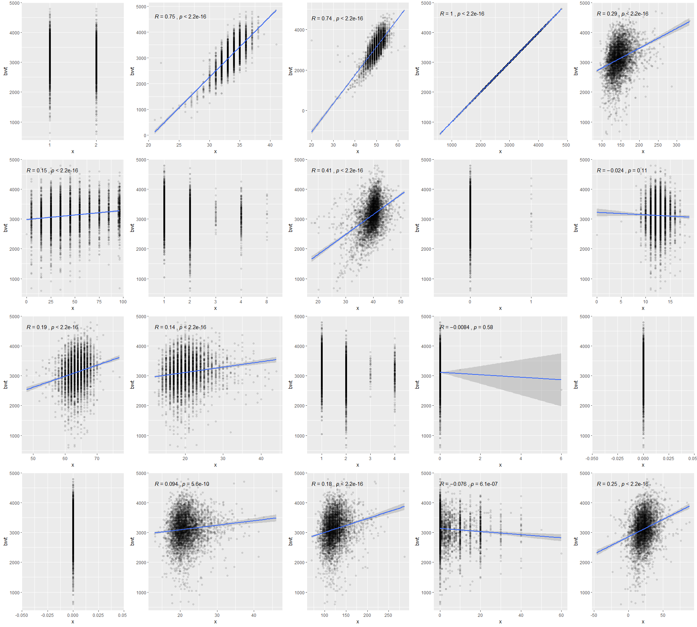

p8105\_hw6\_zz2603
================
Ziyi Zhao
11/22/2019

# Problem 1

``` r
birthwt <- read_csv("./data/birthweight.csv")
```

    ## Parsed with column specification:
    ## cols(
    ##   .default = col_double()
    ## )

    ## See spec(...) for full column specifications.

``` r
## check for NA
nalst <- vector("list",dim(birthwt)[2])
nalst = map(birthwt,is.na) %>% map(sum)
unlist(nalst) %>% as.vector()
```

    ##  [1] 0 0 0 0 0 0 0 0 0 0 0 0 0 0 0 0 0 0 0 0

There is no missing values in the dataset.

``` r
## transfer babysex, frace, malform, mrace into factor
cln_bthwt <- birthwt %>% 
  mutate(babysex = as.factor(babysex),
         babysex = fct_relevel(babysex,"1"),
         frace = as.factor(frace),
         frace = fct_relevel(frace,"1"),
         malform = as.factor(malform),
         malform = fct_relevel(malform,"0"),
         mrace = as.factor(mrace),
         mrace = fct_relevel(mrace,"1"))
```

I want to see how each variable is correlated with birth weight and then
decide which variable to use in the model.

``` r
babybwt <- cln_bthwt[[4]]

crt_corr <- function(x) {
  cln_bthwt %>% ggplot(aes(y=bwt,x=x))+
    geom_point(alpha=0.1)+
    stat_smooth(method = "lm")+
    stat_cor(method="pearson")
}

corr_plotlst <- vector("list",dim(cln_bthwt)[2])
corr_plotlst <- map(cln_bthwt,crt_corr)

ggarrange(plotlist = corr_plotlst,widths = c(4,5))
```

<!-- -->

Based on scatterplots, I found out that variables bhead, blength, delwt,
fincome, gaweeks, mheight, momage, ppbmi, ppwt, smoken, and wtgain are
significantly correlated in the model with outcome of bwt.

I also want to see how every continuous variable is correlated with each
other. We remove variable pnumsga and pnumlbw because there is only one
values 0.

``` r
cont_bthbwt <- cln_bthwt %>% 
  select(bhead, blength, bwt, delwt, fincome, gaweeks, menarche,
         mheight, momage, parity, ppbmi, ppwt, smoken, wtgain)

Hmisc::rcorr(as.matrix(cont_bthbwt)) ## see correlation and p-value
```

    ##          bhead blength   bwt delwt fincome gaweeks menarche mheight momage
    ## bhead     1.00    0.63  0.75  0.21    0.12    0.38     0.00    0.12   0.11
    ## blength   0.63    1.00  0.74  0.23    0.08    0.36    -0.02    0.16   0.08
    ## bwt       0.75    0.74  1.00  0.29    0.15    0.41    -0.02    0.19   0.14
    ## delwt     0.21    0.23  0.29  1.00    0.03    0.12    -0.09    0.41   0.07
    ## fincome   0.12    0.08  0.15  0.03    1.00    0.11     0.00    0.13   0.32
    ## gaweeks   0.38    0.36  0.41  0.12    0.11    1.00     0.00    0.06   0.11
    ## menarche  0.00   -0.02 -0.02 -0.09    0.00    0.00     1.00    0.07   0.18
    ## mheight   0.12    0.16  0.19  0.41    0.13    0.06     0.07    1.00   0.11
    ## momage    0.11    0.08  0.14  0.07    0.32    0.11     0.18    0.11   1.00
    ## parity   -0.02   -0.03 -0.01  0.00   -0.03   -0.08     0.02   -0.01   0.05
    ## ppbmi     0.09    0.07  0.09  0.72   -0.02    0.03    -0.12   -0.10   0.08
    ## ppwt      0.14    0.15  0.18  0.87    0.05    0.06    -0.07    0.43   0.13
    ## smoken   -0.05   -0.07 -0.08  0.05    0.08    0.04     0.02    0.06   0.08
    ## wtgain    0.18    0.19  0.25  0.42   -0.02    0.15    -0.04    0.05  -0.09
    ##          parity ppbmi  ppwt smoken wtgain
    ## bhead     -0.02  0.09  0.14  -0.05   0.18
    ## blength   -0.03  0.07  0.15  -0.07   0.19
    ## bwt       -0.01  0.09  0.18  -0.08   0.25
    ## delwt      0.00  0.72  0.87   0.05   0.42
    ## fincome   -0.03 -0.02  0.05   0.08  -0.02
    ## gaweeks   -0.08  0.03  0.06   0.04   0.15
    ## menarche   0.02 -0.12 -0.07   0.02  -0.04
    ## mheight   -0.01 -0.10  0.43   0.06   0.05
    ## momage     0.05  0.08  0.13   0.08  -0.09
    ## parity     1.00 -0.01 -0.01  -0.01   0.01
    ## ppbmi     -0.01  1.00  0.85   0.01  -0.11
    ## ppwt      -0.01  0.85  1.00   0.04  -0.07
    ## smoken    -0.01  0.01  0.04   1.00   0.03
    ## wtgain     0.01 -0.11 -0.07   0.03   1.00
    ## 
    ## n= 4342 
    ## 
    ## 
    ## P
    ##          bhead  blength bwt    delwt  fincome gaweeks menarche mheight
    ## bhead           0.0000  0.0000 0.0000 0.0000  0.0000  0.8425   0.0000 
    ## blength  0.0000         0.0000 0.0000 0.0000  0.0000  0.1651   0.0000 
    ## bwt      0.0000 0.0000         0.0000 0.0000  0.0000  0.1076   0.0000 
    ## delwt    0.0000 0.0000  0.0000        0.0211  0.0000  0.0000   0.0000 
    ## fincome  0.0000 0.0000  0.0000 0.0211         0.0000  0.8159   0.0000 
    ## gaweeks  0.0000 0.0000  0.0000 0.0000 0.0000          0.9771   0.0000 
    ## menarche 0.8425 0.1651  0.1076 0.0000 0.8159  0.9771           0.0000 
    ## mheight  0.0000 0.0000  0.0000 0.0000 0.0000  0.0000  0.0000          
    ## momage   0.0000 0.0000  0.0000 0.0000 0.0000  0.0000  0.0000   0.0000 
    ## parity   0.1868 0.0324  0.5812 0.7564 0.0874  0.0000  0.1995   0.3765 
    ## ppbmi    0.0000 0.0000  0.0000 0.0000 0.1835  0.0717  0.0000   0.0000 
    ## ppwt     0.0000 0.0000  0.0000 0.0000 0.0018  0.0002  0.0000   0.0000 
    ## smoken   0.0004 0.0000  0.0000 0.0014 0.0000  0.0170  0.2807   0.0000 
    ## wtgain   0.0000 0.0000  0.0000 0.0000 0.2907  0.0000  0.0033   0.0014 
    ##          momage parity ppbmi  ppwt   smoken wtgain
    ## bhead    0.0000 0.1868 0.0000 0.0000 0.0004 0.0000
    ## blength  0.0000 0.0324 0.0000 0.0000 0.0000 0.0000
    ## bwt      0.0000 0.5812 0.0000 0.0000 0.0000 0.0000
    ## delwt    0.0000 0.7564 0.0000 0.0000 0.0014 0.0000
    ## fincome  0.0000 0.0874 0.1835 0.0018 0.0000 0.2907
    ## gaweeks  0.0000 0.0000 0.0717 0.0002 0.0170 0.0000
    ## menarche 0.0000 0.1995 0.0000 0.0000 0.2807 0.0033
    ## mheight  0.0000 0.3765 0.0000 0.0000 0.0000 0.0014
    ## momage          0.0006 0.0000 0.0000 0.0000 0.0000
    ## parity   0.0006        0.6962 0.4605 0.7134 0.4654
    ## ppbmi    0.0000 0.6962        0.0000 0.6436 0.0000
    ## ppwt     0.0000 0.4605 0.0000        0.0105 0.0000
    ## smoken   0.0000 0.7134 0.6436 0.0105        0.0745
    ## wtgain   0.0000 0.4654 0.0000 0.0000 0.0745

``` r
## see it visually
cor(cont_bthbwt) %>% corrplot::corrplot()
```

<!-- -->

From the plot, we can find out several pairs of variables are highly
correlated,such as pairs of variable bmi and weights, and pairs of head
size and length.

Let’s see hypothesized structure of model of birthweight. According to
my brief review of literature and websites, I found that baby’s sex,
parental race, mother’s pre-pregnancy bmi (or weight), and gestational
age can affect birthweight.

Since it will take too much time and effort to do variable selection or
random forest test, I will combine the results from basic correlation
analysis and hypothesize structure.

Proposed model: babysex, blength, gaweeks, mrace, and ppbmi.

``` r
prop_df <- cln_bthwt %>% 
  select(bwt,babysex,blength,gaweeks,mrace,ppbmi) %>% 
  mutate(id = c(1:dim(cln_bthwt)[1]))
 
train_df <- sample_frac(prop_df,0.8)
test_df <- anti_join(prop_df, train_df, by="id")

linear_mod = lm(bwt~babysex+blength+gaweeks+mrace+ppbmi,data=train_df)

linear_pred = add_predictions(train_df,linear_mod) %>% pull(pred)
linear_resid = add_residuals(train_df,linear_mod) %>% pull(resid)

pred_resid = tibble(linear_pred,linear_resid)

ggplot(pred_resid,aes(y=linear_resid,x=linear_pred))+
  geom_point()+stat_smooth()
```

    ## `geom_smooth()` using method = 'gam' and formula 'y ~ s(x, bs = "cs")'

<!-- -->

I may propose a wrong model.

``` r
cv_df = crossv_mc(cln_bthwt,100,test=0.2) %>% 
  mutate(train=map(train,as_tibble),
         test=map(test,as_tibble)) %>% 
  mutate(prop_mod = map(train,
                        ~lm(bwt~babysex+blength+gaweeks+mrace+ppbmi,
                            data = .x)),
         first_mod = map(train,~lm(bwt~blength+gaweeks,data=.x)),
         second_mod = map(train,
                          ~lm(bwt~bhead+blength+babysex+bhead*blength+
                                 bhead*babysex+blength*babysex+
                                 bhead*blength*babysex,data=.x))) %>%
  mutate(rmse_prop = map2_dbl(prop_mod,test,~rmse(model=.x,data=.y)),
         rmse_first = map2_dbl(first_mod,test,~rmse(model=.x,data=.y)),
         rmse_second = map2_dbl(second_mod,test,~rmse(model=.x,data=.y)))

cv_df %>% 
  select(starts_with("rmse")) %>% 
  pivot_longer(everything(),
    names_to = "model",
    values_to = "rmse",
    names_prefix = "rmse_") %>% 
  mutate(model=fct_inorder(model)) %>% 
  ggplot(aes(x=model,y=rmse))+geom_violin()
```

<!-- -->

I don’t think I fit correct model. I should fit smooth model here, but
it returned error.

# Problem 2

``` r
weather_df = 
  rnoaa::meteo_pull_monitors(
    c("USW00094728"),
    var = c("PRCP", "TMIN", "TMAX"), 
    date_min = "2017-01-01",
    date_max = "2017-12-31") %>%
  mutate(
    name = recode(id, USW00094728 = "CentralPark_NY"),
    tmin = tmin / 10,
    tmax = tmax / 10) %>%
  select(name, id, everything())
```

    ## Registered S3 method overwritten by 'crul':
    ##   method                 from
    ##   as.character.form_file httr

    ## Registered S3 method overwritten by 'hoardr':
    ##   method           from
    ##   print.cache_info httr

    ## file path:          C:\Users\zzhao\AppData\Local\rnoaa\rnoaa\Cache/ghcnd/USW00094728.dly

    ## file last updated:  2019-11-24 19:11:09

    ## file min/max dates: 1869-01-01 / 2019-11-30

``` r
## create a plot
weather_df %>% ggplot(aes(y=tmax,x=tmin))+
  geom_point(alpha=0.5)+stat_smooth(method = "lm")
```

<!-- -->

``` r
## fit model
lm(tmax~tmin,data=weather_df) %>% broom::tidy() %>% knitr::kable(digits = 3)
```

| term        | estimate | std.error | statistic | p.value |
| :---------- | -------: | --------: | --------: | ------: |
| (Intercept) |    7.209 |     0.226 |    31.847 |       0 |
| tmin        |    1.039 |     0.017 |    61.161 |       0 |

``` r
## create 5000 bootstrap samples
boot_strap = weather_df %>% bootstrap(n=5000)

## get estimate R-square
boot_strap %>% mutate(models = map(strap,~lm(tmax~tmin,data=.x)),
                      results = map(models,broom::glance))%>% 
  select(-strap,-models) %>% 
  unnest(results) %>% janitor::clean_names() %>% 
  pull(r_squared) %>% as.vector() %>% 
  quantile(probs=c(0.025, 0.975), na.rm=TRUE)
```

    ##      2.5%     97.5% 
    ## 0.8928582 0.9276764

``` r
## make plot for estimate r-square
boot_strap %>% mutate(models = map(strap,~lm(tmax~tmin,data=.x)),
                      results = map(models,broom::glance))%>% 
  select(-strap,-models) %>% 
  unnest(results) %>% janitor::clean_names() %>% 
  ggplot(aes(x=r_squared))+geom_density()
```

<!-- -->

From the density plot, r-squared values are skewed to left.

``` r
## get log(beta_hat0*beta_hat1)
beta_df <- boot_strap %>% mutate(models = map(strap,~lm(tmax~tmin,data=.x)),
                      results = map(models,broom::tidy)) %>% 
  select(-strap,-models) %>% 
  unnest(results) %>% 
  select(term,estimate) %>% 
  pivot_wider(names_from = "term",
              values_from = "estimate")
```

    ## Warning: Values in `estimate` are not uniquely identified; output will contain list-cols.
    ## * Use `values_fn = list(estimate = list)` to suppress this warning.
    ## * Use `values_fn = list(estimate = length)` to identify where the duplicates arise
    ## * Use `values_fn = list(estimate = summary_fun)` to summarise duplicates

``` r
beta0hat <- beta_df[[1]] %>% unlist()
beta1hat <- beta_df[[2]] %>% unlist()

betahat_df <- tibble(beta0hat,beta1hat,log_betahat = log(beta0hat*beta1hat))

pull(betahat_df,log_betahat) %>% as.vector() %>% 
  quantile(probs=c(0.025, 0.975), na.rm=TRUE)
```

    ##     2.5%    97.5% 
    ## 1.964911 2.058783

``` r
betahat_df %>% 
  ggplot(aes(log_betahat))+geom_density()
```

<!-- -->

From the plot of log(beta0\*beta1), the shape of density plot is
balanced and symmetrics.
